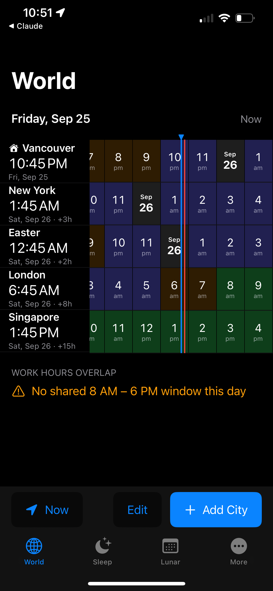
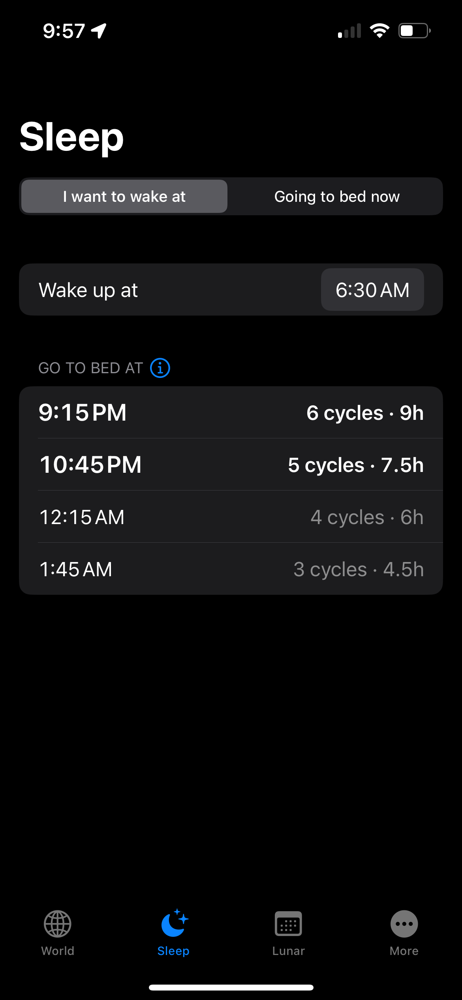
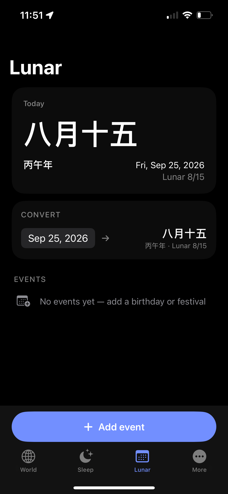
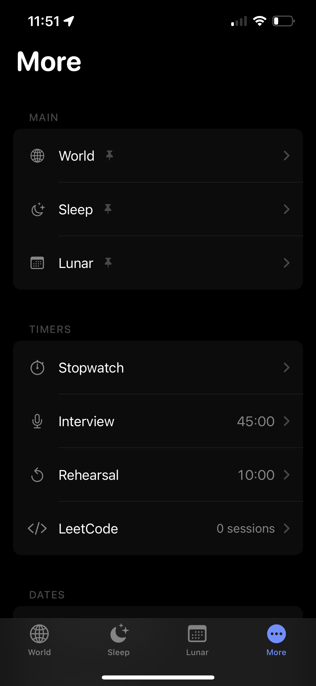

# Every Time

> 🚧 Work in progress — iPhone app functional (Wait times is sample data); widget and watch are stubs. Docs: `docs/design/iphone-v1/`.

Everything about time, in one free iPhone app.

- **World** — World Time Buddy–style planner: city column pinned left, hour
  strips share one horizontal scroll from a week back to a week ahead, a
  center cursor shows every city's time at that instant, work-hour overlaps listed as jump targets.
- **Sleep** — bedtimes for a wake time (or wake times for "bed now") from
  ~90-minute sleep cycles.
- **Nap** — nap timer with a wake alarm, best nap window from your age and
  usual sleep (or tonight's planned bed and tomorrow's wake), the likely effect
  on tonight's sleep and on grogginess, and a log you rate by how the night
  went, to see your own pattern.
- **Jet lag planner** — per-trip plan of light, sleep, caffeine and melatonin
  timing to shift your body clock, from your usual sleep hours.
- **Lunar** — today's Chinese lunar date, a converter, and lunar events
  (once / monthly / yearly) with their next Gregorian date, optionally added
  to the iPhone Calendar.
- **Countdown** — count down to any date/time; the biggest remaining unit
  is the hero (days, then hours, minutes, seconds), sideways full screen,
  and fireworks or confetti, sound, vibration and a notification when it ends.
- **More** — flat list of the rest: stopwatch, interview timer, rehearsal
  timer, LeetCode timer with session history, work timer (clock in/out,
  breaks, daily history, CSV export), important events (from the
  iPhone Calendar or by hand: time since, next anniversary, yearly reminder), wait times,
  Unix timestamp, timestamp converter, cron parser. Timers open a full-screen
  sideways clock. Settings: iCloud Drive and local zip backups
  (`EveryTime/Backup/README.md`).

Planned: a companion Apple Watch app and a home-screen clock widget.

## Setup

Requires [XcodeGen](https://github.com/yonaskolb/XcodeGen).

```
xcodegen generate && open EveryTime.xcodeproj
```

Install on a device (team ID from env, never committed). iCloud backup needs a paid team with
container `iCloud.com.solomonxie.everytime` registered (Xcode → Signing & Capabilities → iCloud):

```
xcodebuild -scheme EveryTime -destination id=$DEVICE_UDID -allowProvisioningUpdates \
  DEVELOPMENT_TEAM=$TEAM_ID build
xcrun devicectl device install app --device $DEVICE_UDID <DerivedData>/Debug-iphoneos/EveryTime.app
```

## Watch target note

The watch app is built as a modern single-target app (`type: application`,
`platform: watchOS`, `WKApplication = YES`) embedded in the iOS app, rather
than XcodeGen's `application.watchapp2` product type. On Xcode 26+,
`application.watchapp2` emits a stale "Embed Watch Content" copy phase that
collides with Xcode's own product install step and fails the build with
"Multiple commands produce ...EveryTimeWatch.app/EveryTimeWatch" — a known
XcodeGen/Xcode incompatibility (yonaskolb/XcodeGen#1613). The plain
`application` product type sidesteps it and is itself how modern Xcode
project templates set up single-target watch apps.

## Screenshots

| World | Sleep | Lunar | More |
|---|---|---|---|
|  |  |  |  |
