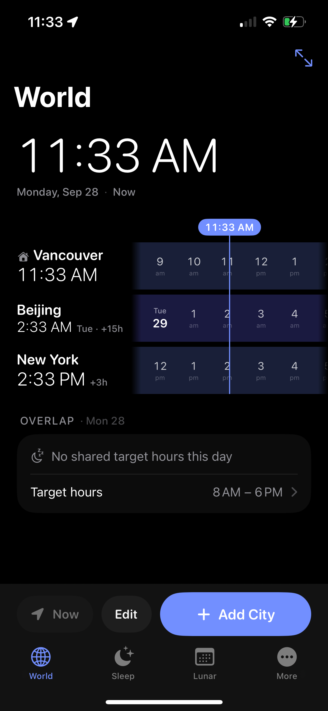
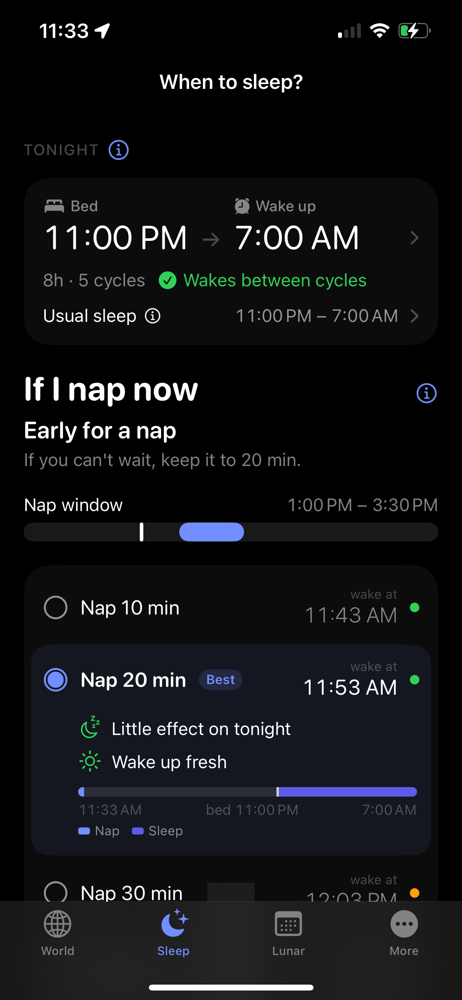
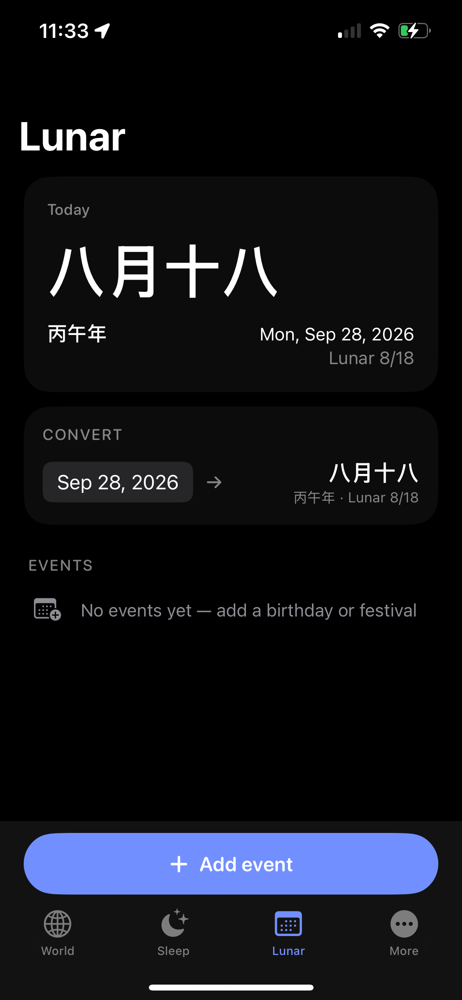
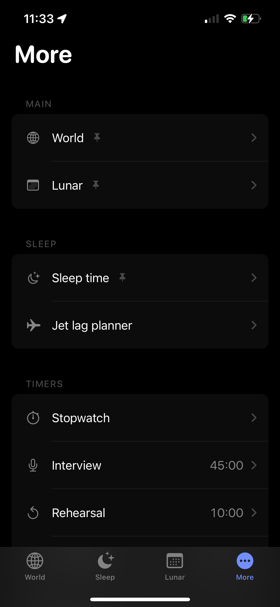

# Every Time

> 🚧 Work in progress — iPhone app, widget and watch functional (Wait times is sample data). Docs: `docs/design/iphone-v1/`, `docs/design/boards/`.

Everything about time, in one free iPhone app.

- **World** — World Time Buddy–style planner: city column pinned left, hour
  strips share one horizontal scroll from a week back to a week ahead, a
  center cursor shows every city's time at that instant, work-hour overlaps listed as jump targets.
- **Sleep time** ("When to sleep?") — what sleeping now (or in 15/30/60 min)
  means, judged against tonight's planned bed and wake: a nap with its effect
  on tonight and on grogginess, an earlier bedtime, a warning when evening
  sleep would split the night, or ~90-minute-cycle wake times at night. A
  timeline shows each option; naps get a wake alarm plus a backup. Tonight's
  bed/wake plan, bedtimes for the wake time, and a nap log you rate by how
  the night went, to see your own pattern.
- **Jet lag planner** — per-trip plan of light, sleep, caffeine and melatonin
  timing to shift your body clock, from your usual sleep hours.
- **Lunar** — today's Chinese lunar date, a converter, and lunar events
  (once / monthly / yearly) with their next Gregorian date, optionally added
  to the iPhone Calendar.
- **Countdown** — count down to any date/time; the biggest remaining unit
  is the hero (days, then hours, minutes, seconds), sideways full screen,
  and fireworks or confetti, sound, vibration and a notification when it ends.
- **Boards** (coming soon — code kept, page shows a placeholder) — ZenHub-style project boards stored in Reminders: a list is a
  board, a reminder is a card, completed is Done. Kanban columns with drag &
  drop, a roadmap of due dates and calendar milestones, and insights
  (burn-up, velocity, flow). Nothing leaves the phone (`docs/design/boards/`).
- **More** — flat list of the rest: stopwatch, interview timer, rehearsal
  timer, LeetCode timer with session history, work timer (clock in/out,
  breaks, daily history, CSV export), important events (from the
  iPhone Calendar or by hand: time since, next anniversary, yearly reminder), on this day
  (Wikipedia events, births, deaths, holidays for any date), wait times,
  Unix timestamp, timestamp converter, cron parser. Timers open a full-screen
  sideways clock. Settings: iCloud Drive and local zip backups
  (`EveryTime/Backup/README.md`).

- **Widgets** — World clock (small, medium, Lock Screen) and next Countdown.
- **Apple Watch** — World times, upcoming countdowns, sleep-now wake times.

The widget reads a snapshot of cities and countdowns from App Group
`group.com.solomonxie.everytime`; the watch gets the same snapshot over
WatchConnectivity (`Glance/`). The app publishes it whenever it moves between foreground and background.

## Setup

Requires [XcodeGen](https://github.com/yonaskolb/XcodeGen).

```
xcodegen generate && open EveryTime.xcodeproj
```

Install on a device (team ID from env, never committed). iCloud backup and the widget's App Group need a paid team; `-allowProvisioningUpdates` registers them:

```
xcodebuild -scheme EveryTime -destination id=$DEVICE_UDID -allowProvisioningUpdates \
  DEVELOPMENT_TEAM=$TEAM_ID build
xcrun devicectl device install app --device $DEVICE_UDID <DerivedData>/Debug-iphoneos/EveryTime.app
```

## Watch target note

The watch app is built as a modern single-target app (`type: application`,
`platform: watchOS`, `WKApplication = YES`) embedded in the iOS app, rather
than XcodeGen's `application.watchapp2` product type. On Xcode 26+,
`application.watchapp2` emits a stale "Embed Watch Content" copy phase that
collides with Xcode's own product install step and fails the build with
"Multiple commands produce ...EveryTimeWatch.app/EveryTimeWatch" — a known
XcodeGen/Xcode incompatibility (yonaskolb/XcodeGen#1613). The plain
`application` product type sidesteps it and is itself how modern Xcode
project templates set up single-target watch apps.

## Screenshots

| World | Sleep | Lunar | More |
|---|---|---|---|
|  |  |  |  |
