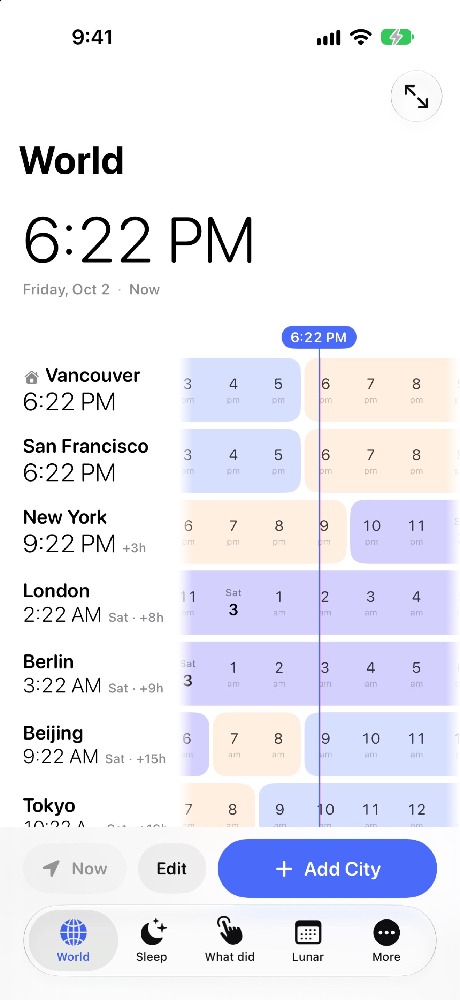
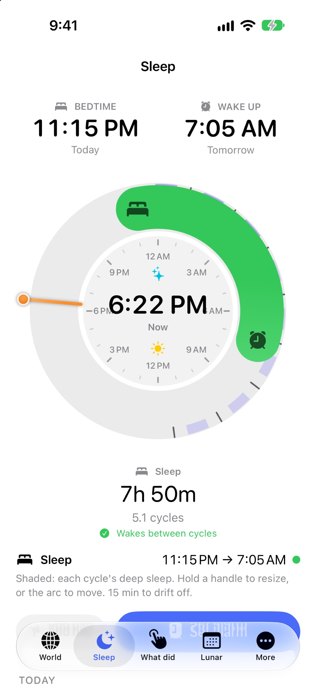
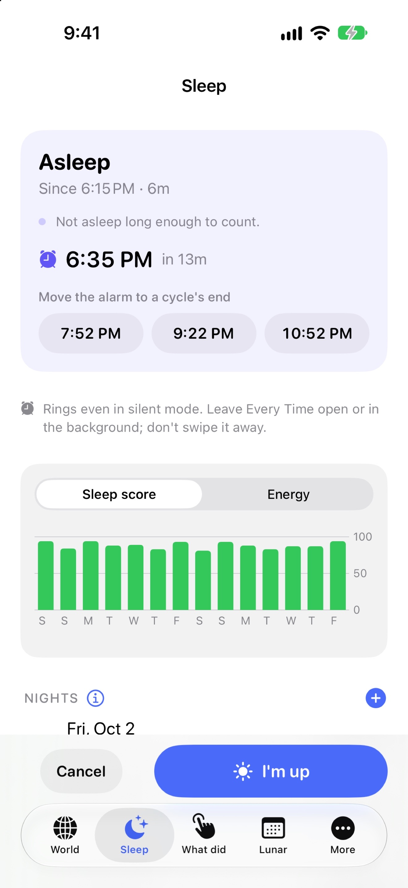
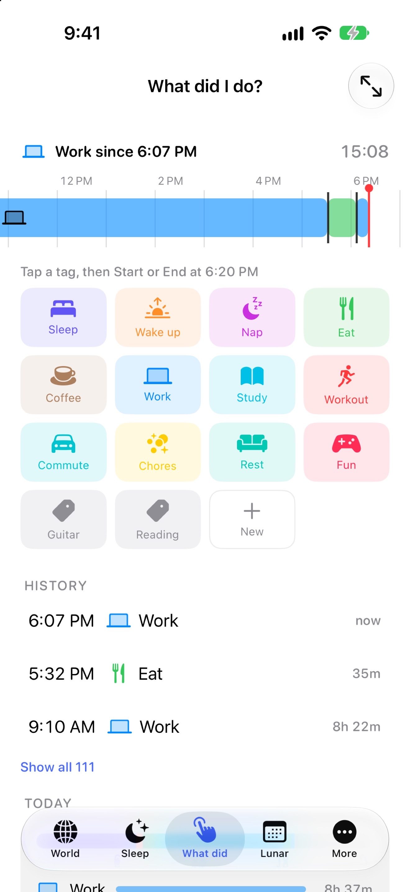
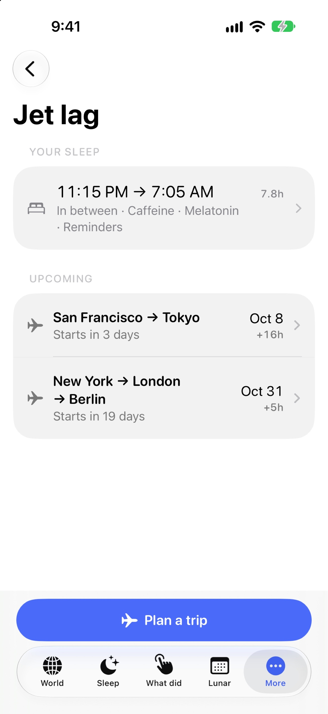
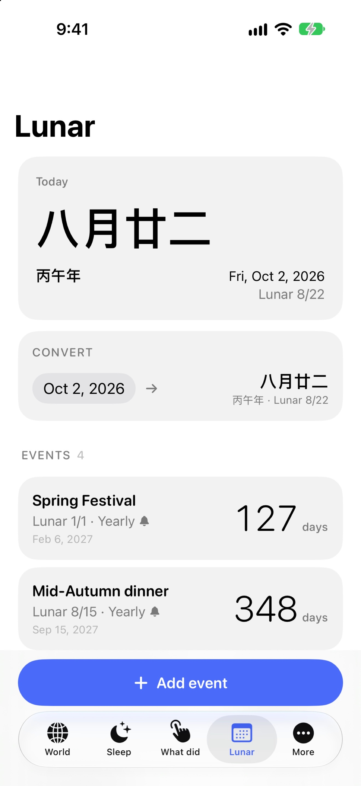
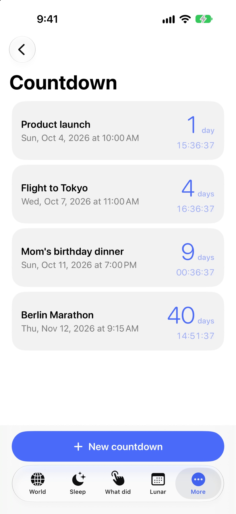
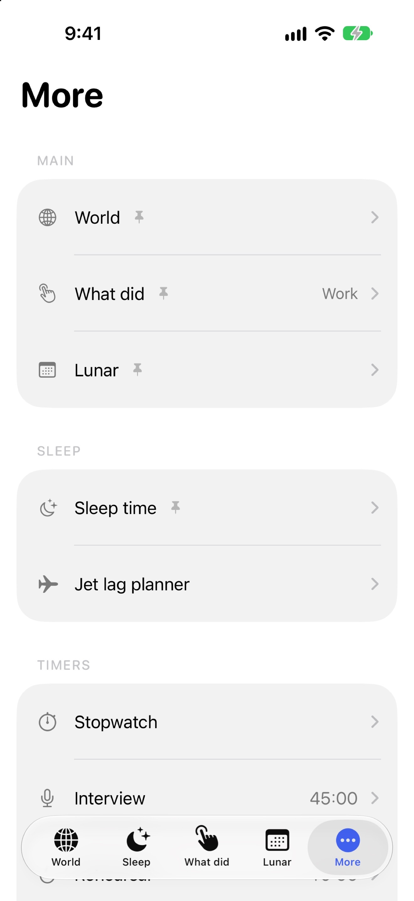

# Every Time

> 🚧 Work in progress — iPhone app and widget functional. Docs: `docs/design/iphone-v1/`, `docs/design/boards/`.

Everything about time, in one free iPhone app.

- **World** — World Time Buddy–style planner: city column pinned left, hour
  strips share one horizontal scroll from a week back to a week ahead, a
  center cursor shows every city's time at that instant, work-hour overlaps listed as jump targets.
  Add a city or a zone by name: PST/CET (region zone plus fixed offset), UTC+8, Asia/Shanghai.
- **Sleep** — decide one end of the night, get the other: "Wake up by" lists
  bedtimes on ~90-minute cycles (sleep now, or wait so cycles end right at it;
  bell for a wind-down reminder); "Sleep at" lists wake times, with a nap by
  day and its effect on tonight. Tap to sleep with an alarm plus a backup;
  while asleep, cycles so far and the next cycle ends to move the alarm to.
  On waking: energy 1–5, or sleep more to the next cycle. Today tiles for
  coffee cutoff, energy and sleep debt; score/energy chart; nights scored
  0–100 (own log plus Health); a nap log rated by how the night went.
- **What did** — a continuous day log on a drag-through timeline: Mark (or tap
  the timeline anywhere) to drop a pin; the range it closes takes a tag, or
  none. History under it, folded to 3; today's totals, 7-day averages and
  typical bed/wake. The Sleep page marks naps and wakes into it.
- **Jet lag planner** — per-trip plan of light, sleep, caffeine and melatonin
  timing to shift your body clock, from your usual sleep hours.
- **Lunar** — today's Chinese lunar date, a converter, and lunar events
  (once / monthly / yearly) with their next Gregorian date, optionally added
  to the iPhone Calendar.
- **Countdown** — count down to any date/time; the biggest remaining unit
  is the hero (days, then hours, minutes, seconds), sideways full screen,
  and fireworks or confetti, sound, vibration and a notification when it ends.
- **Boards** (on hold for 1.0 — code kept, excluded from the build in `project.yml`) — ZenHub-style project boards stored in Reminders: a list is a
  board, a reminder is a card, completed is Done. Kanban columns with drag &
  drop, a roadmap of due dates and calendar milestones, and insights
  (burn-up, velocity, flow). Nothing leaves the phone (`docs/design/boards/`).
- **More** — flat list of the rest: stopwatch, interview timer, rehearsal
  timer, LeetCode timer with session history, work timer (clock in/out,
  breaks, daily history, CSV export), important events (from the
  iPhone Calendar or by hand: time since, next anniversary, yearly reminder), on this day
  (Wikipedia events, births, deaths, holidays for any date),
  Unix timestamp, timestamp converter, cron parser. Timers open a full-screen
  sideways clock. Settings: iCloud Drive and local zip backups
  (`EveryTime/Backup/README.md`).

- **Widgets** — World clock (small, medium, Lock Screen) and next Countdown.

The widget reads a snapshot of cities and countdowns from App Group
`group.com.example.everytime`(`Glance/`). The app publishes it whenever it moves between foreground and background.

## Setup

Requires [XcodeGen](https://github.com/yonaskolb/XcodeGen).

```
xcodegen generate && open EveryTime.xcodeproj
```

Install (iCloud backup and the widget's App Group need a paid team; `-allowProvisioningUpdates` registers them):

```
make device             # DEVICE_UDID, TEAM_ID from env or .env (see .env.example), never committed
make sim                # SIM="iPhone 18 Pro" by default
make device STORE=cn    # store region, default us (Canada/US)
```

`STORE` → Info.plist `AppStoreRegion` (`us`|`cn`), read via `StoreRegion.current`.

## Demo mode

More → Demo mode: instant switch to a separate store (`<bundle id>.demo-data`); real data, notifications, widget and backups untouched. Doesn't read Health or write to Calendar. Off → back to real data.

- Preset data: `demo/*.json`, store key → value (`app-storage.json` = plain `@AppStorage` values). Dates are relative: `"@today-1 23:40"`, `"@now-25m"`, `"@now+3h"`. Re-seeded daily or via More → Demo → Reset demo data.

## Screenshots

| | | |
|:-:|:-:|:-:|
| **World**<br> | **Sleep ring**<br> | **Nap alarm**<br> |
| **What did**<br> | **Jet lag planner**<br> | **Lunar**<br> |
| **Countdowns**<br> | **More**<br> |  |
